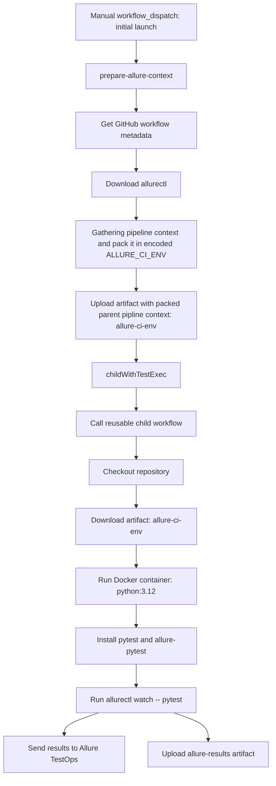

# Small parameterized test using pytest running in a , which generates result files 

## Project Purpose

The project is used for learning how to write CI/CD pipelines and work with GitHub Actions, including:

* Automating test execution
* Generating Allure reports
* Integrating with allurectl

## Local launch from IDEA

To run this project locally in PyCharm, you need to integrate Allure Framework.
Follow the official documentation: [Allure for Pytest](https://allurereport.org/docs/pytest/)

Additionally, ensure that the virtual environment (.venv) is correctly configured in PyCharm:

* Open Settings → Project: YourProject → Python Interpreter.
* Set the interpreter to use the virtual environment (.venv).

### Running Tests with Allure
```bash
python -m pytest --alluredir allure-results --clean-alluredir
```

### Pipeline execution process 


