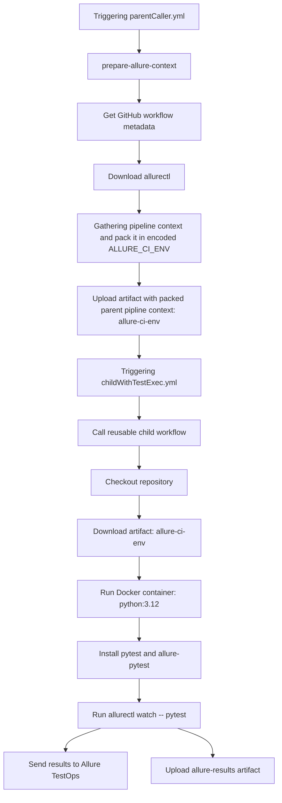

# Small example of a multi-job pipeline with test in a Docker container

### Pipeline execution process 

### 422 Error When Triggering a Pipeline from TestOps

A detailed explanation of this error can be found in the following documentation section:

[Error 422 when triggering GitHub workflow from Allure TestOps interface](https://docs.qameta.io/allure-testops/integrations/github/#error-422-when-triggering-github-workflow-from-allure-testops-interface)

In the pipeline used in this example, the same issue may occur if the `SECOND_DUMMY_INPUT` parameter defined in `parentCaller.yml` is marked as required, but is either:

* Missing from the job configuration in Allure TestOps
* Does not have a default value configured.

#### Reference Configuration

This configuration will successfully trigger the pipeline because the required input is properly configured.

### Examples That Cause the Error

In the example below, a 422 error will occur because `SECOND_DUMMY_INPUT` is missing from the job configuration.

---

In the example below, a 422 error will occur because no default value is configured for `SECOND_DUMMY_INPUT`, even though the parameter is marked as required on the GitHub side.

